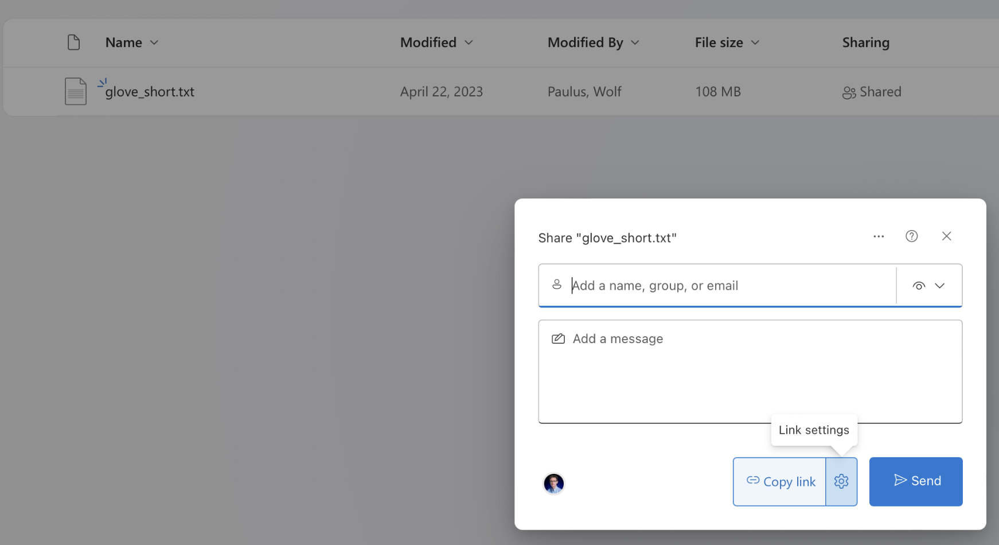
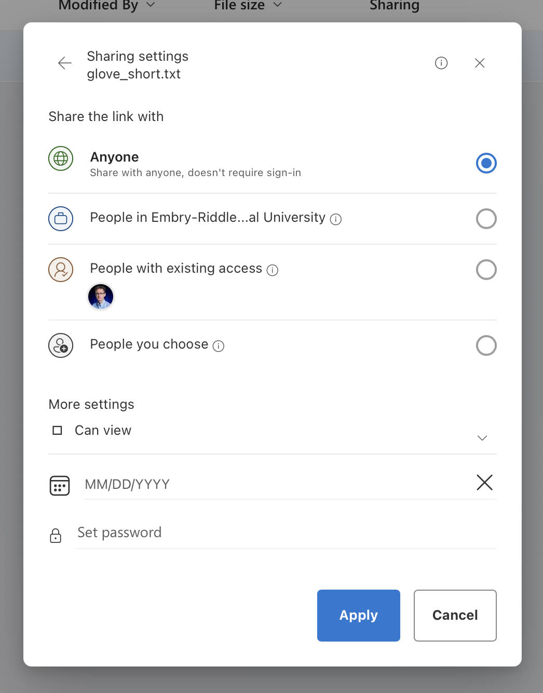

CS399 Module 7: ai Exploring Neural Word Embeddings with Python
# Assignment

Finding outliers in a list of words.
"outliers - things differing from all other members of a particular group or set"
Utilizing what you have learned in this module, 
write a short program that uses a pre-trained Word2Vec model to remove outliers 
from a list of given words. You could start your program like this:

```
"""
    Remove Outliers from a list of words
    Author: John Doe
"""
from wv import Model
from scipy.stats import zscore

model = Model("models/glove_short.txt")
while True:
    words = input("Please enter a comma separated list of words: ").split("")
```

You could end the program if less than 3 words were provided
or a vector representation of a word could not be found in the model.

Please limit additional imports und use pythonic code
Try different models and a comment wrt why you picked the one in your submission. 
As a very minimum, I would expect an output like this:

```
Loading model from models/glove_short.txt ...
Loaded in 5.019477 secs
Please enter a comma separated list of words: >? apple banana mango car
With outliers removed your list looks like this: apple banana mango.
Please enter a comma separated list of words: >? apple banana mango car pizza
With outliers removed your list looks like this: apple banana mango pizza.
Please enter a comma separated list of words: >? apple banana mango orange car bus cherry
With outliers removed your list looks like this: apple banana mango orange cherry.
Please enter a comma separated list of words: >?
```

EXTRA CREDIT is available if your app has a streamlit UI
app.py is your starting point for that ... `streamlit run app.py`

### What not to push ..?
Don't add binaries or 3rd party libraries to your source code repositories.
Instead, add source code that YOU wrote.
Data models can be rather large. AWS S3, Azure, Google Drive, or One Drive may be good services for hosting datamodels.
To you One-Drive for instance, you could share a model publically and add the url to your application later. E.g.



## Additional Resources
https://blog.esciencecenter.nl/king-man-woman-king-9a7fd2935a85
https://www.geeksforgeeks.org/detect-and-remove-the-outliers-using-python/
https://www.assemblyai.com/blog/6-best-ai-playgrounds/
https://fasttext.cc/docs/en/english-vectors.html